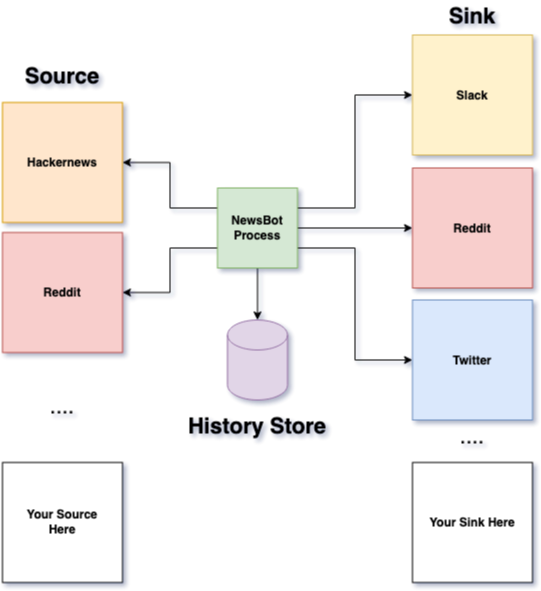

# Go News Bot

## Architecture

## Terminology

`Source` - _Where data comes from, whether it's a website, file, etc_

`Sink` - _Where data is stored or uploaded, like a social network, SMS or slack message_

## Background

This bot is designed to support `polling` for updates from one or more `sources`. Once data is pulled from a `source` (i.e. Reddit.com, news.ycombinator.com, yahoo news, google finance, etc.), the bot interfaces allow a developer to manipulate that response and serialize into a structure that different `sinks` can understand. 

### Example

- Every 30 minutes I want to check _hackernews_ for updates to the top post. If the post is new or hasn't been stored before, then I want to post it to Twitter and Reddit.

In the above example, we would have a `source` implementation for `hackernews` that conforms to the [src/source.go](src/Source.go) interface. 

> This implementation will support anything you want to do to obtain the source information via the `Scrape()` method invocation. The two other functions `CheckDuplicatePost()` will check the database or file to see if it's been stored or process already and `WriteUpload()` will persist any new updates after the fanout process has completed.

Once the `source` is implemented, we can implement `sinks` which specify _where_ we want to upload data as it comes in. You can write your `sink` to conform to the `Sink` interface underneath the src directory within the [/src/sink.go](/src/sink.go) interface.

> This implementation for a sink has opportunities to cache authentication credentials for things like OAuth or http basic auth, a URI for locating the endpoint for a REST API or similar TCP-based endpoint as well as a generic `Upload(p *Post)` function that will do processing on your deserialized `Post` struct.